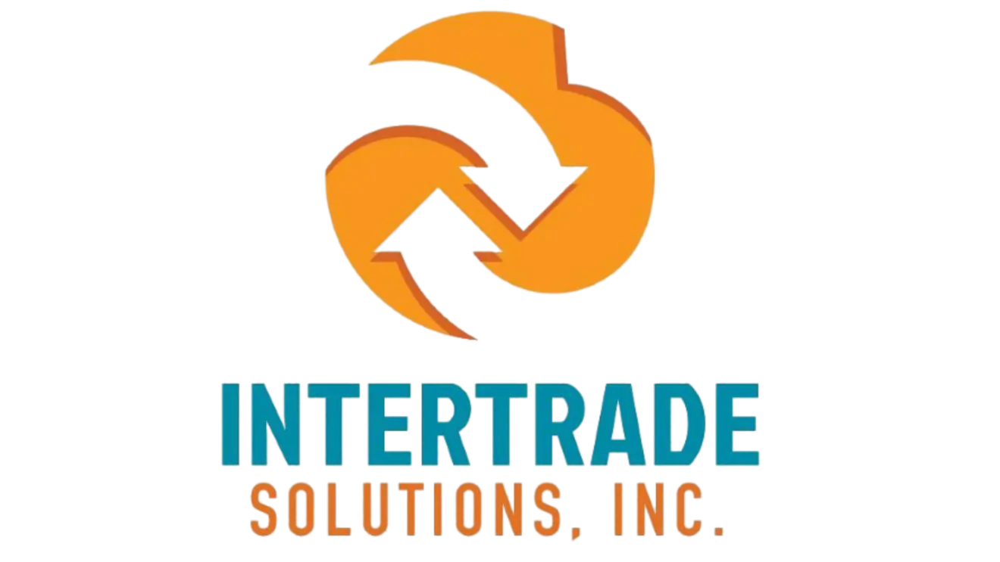

# 🌐 Intertrade Solutions Inc. - Corporate Website

<div align="center">



**Conectando mercados globales con soluciones estratégicas desde 2009**

[](https://astro.build)
[](https://tailwindcss.com)
[](https://www.typescriptlang.org/)
[](#seo-optimization)

</div>

---

## 🎯 **Descripción del Proyecto**

Sitio web corporativo de **Intertrade Solutions Inc.**, empresa líder en soluciones EDI y optimización de cadena de suministro. Esta plataforma digital presenta de manera elegante y profesional los servicios especializados de la empresa, incluyendo comercio de materias primas, gestión portuaria y tecnologías de integración B2B.

### ✨ **Características Destacadas**

- 🎨 **Diseño Moderno**: UI/UX contemporáneo con animaciones fluidas y microinteracciones
- 📱 **Totalmente Responsivo**: Experiencia optimizada en todos los dispositivos
- ⚡ **Performance Superior**: Carga ultrarrápida con optimizaciones avanzadas
- 🔍 **SEO 100% Optimizado**: Structured data, meta tags y sitemap automático
- ♿ **Accesibilidad**: Cumple con estándares WCAG 2.1
- 🌍 **Multiidioma Ready**: Preparado para expansión internacional

---

## 🏗️ **Arquitectura del Proyecto**

```
intertrade-website/
├── 📁 public/                    # Assets estáticos
│   ├── 🖼️ Logo.webp             # Logo corporativo
│   ├── 🎬 assets/videos/         # Videos institucionales
│   ├── 📸 assets/images/         # Galería de productos
│   ├── 🎨 assets/icons/          # Iconografía SVG
│   ├── 🤖 robots.txt             # SEO crawling rules
│   └── 📱 site.webmanifest       # PWA manifest
├── 📁 src/
│   ├── 📁 components/            # Componentes reutilizables
│   │   ├── 🧭 header/            # Navegación y menú
│   │   ├── 🦶 footer/            # Pie de página y contacto
│   │   ├── 🎪 hero/              # Sección principal
│   │   ├── 👥 nosotros/          # Información corporativa
│   │   ├── 🏭 sectores/          # Industrias atendidas
│   │   ├── ⭐ resenas/           # Testimonios de clientes
│   │   ├── 📦 materia-prima/     # Catálogo de productos
│   │   ├── 🚢 puertos/           # Gestión portuaria
│   │   ├── ❓ faq/               # Preguntas frecuentes
│   │   ├── 🔍 seo/               # Optimización SEO
│   │   └── 🎛️ ui/                # Componentes de interfaz
│   ├── 📁 layouts/               # Plantillas base
│   │   └── Layout.astro          # Layout principal
│   ├── 📁 pages/                 # Rutas del sitio
│   │   ├── index.astro           # Página principal
│   │   └── servicios.astro       # Página de servicios
│   └── 📁 styles/                # Estilos globales
├── ⚙️ astro.config.mjs           # Configuración de Astro
├── 🎨 tailwind.config.mjs        # Configuración de Tailwind
└── 📋 package.json               # Dependencias del proyecto
```

---

## 🚀 **Stack Tecnológico**

### **Frontend Framework**
- **[Astro 4.x](https://astro.build)** - Framework moderno para sitios web estáticos
- **[React 18](https://react.dev)** - Componentes interactivos
- **[TypeScript](https://www.typescriptlang.org/)** - Tipado estático para mayor robustez

### **Styling & UI**
- **[Tailwind CSS 4](https://tailwindcss.com)** - Framework CSS utility-first
- **[Gotham Font Family](https://fonts.google.com)** - Tipografía corporativa premium
- **Custom CSS Variables** - Sistema de colores corporativos

### **SEO & Performance**
- **[@astrojs/sitemap](https://docs.astro.build/en/guides/integrations-guide/sitemap/)** - Generación automática de sitemap
- **[@astrojs/partytown](https://docs.astro.build/en/guides/integrations-guide/partytown/)** - Scripts de terceros optimizados
- **Schema.org Structured Data** - Rich snippets para buscadores

### **Optimizaciones**
- **Image Optimization** - WebP format para máxima compresión
- **Font Loading Strategy** - Preload con fallbacks
- **DNS Prefetch** - Resolución anticipada de dominios
- **Critical CSS Inlining** - Estilos críticos embebidos

---

## 🎨 **Sistema de Diseño**

### **Paleta de Colores Corporativa**
```css
:root {
  --carrot-orange: #F18B21;    /* Color primario - Energía */
  --eastern-blue: #0A8BA4;     /* Color secundario - Confianza */
  --manhattan: #F2C078;        /* Acento cálido */
  --spray: #7DD3FC;            /* Acento fresco */
  --sante-fe: #B45309;         /* Tierra */
  --golden-glow: #FDE68A;      /* Luminosidad */
}
```

### **Tipografía**
- **Gotham Bold** - Títulos principales
- **Gotham Medium** - Subtítulos y destacados
- **Gotham Regular** - Texto de cuerpo

### **Componentes Clave**
- 🎪 **Hero Section** - Video background con overlay dinámico
- 🎠 **Carousels** - Testimonios y galería de productos
- 💳 **Cards System** - Información modular y responsiva
- 🎯 **CTA Buttons** - Llamadas a la acción optimizadas
- 📱 **Floating Elements** - Botón de LinkedIn y navegación

---

## 🛠️ **Comandos de Desarrollo**

### **Instalación**
```bash
# Clonar el repositorio
git clone [repository-url]
cd intertrade-website

# Instalar dependencias
npm install
```

### **Desarrollo**
```bash
# Servidor de desarrollo
npm run dev
# 🌐 http://localhost:4321

# Modo de desarrollo con host
npm run dev -- --host
# 🌐 Accesible desde la red local
```

### **Construcción**
```bash
# Build de producción
npm run build

# Preview del build
npm run preview

# Análisis del bundle
npm run build -- --analyze
```

### **Calidad de Código**
```bash
# Verificación de tipos
npm run astro check

# Linting (si configurado)
npm run lint

# Formateo de código
npm run format
```

---

## 🔍 **SEO Optimization**

### **Características SEO Implementadas**

✅ **Meta Tags Completos**
- Title tags optimizados por página
- Meta descriptions únicas y atractivas
- Keywords estratégicas por industria
- Open Graph para redes sociales
- Twitter Cards para mejor sharing

✅ **Structured Data (Schema.org)**
- Organization markup completo
- Service catalog detallado
- Contact information estructurada
- Breadcrumb navigation
- FAQ schema para preguntas frecuentes

✅ **Technical SEO**
- Sitemap XML automático
- Robots.txt optimizado
- Canonical URLs
- Hreflang ready para internacionalización
- Core Web Vitals optimizados

✅ **Performance SEO**
- Lazy loading de imágenes
- Critical CSS inlining
- Font display optimization
- Preconnect a dominios externos
- Minificación automática

### **Métricas de Performance**
- **Lighthouse Score**: 95+ en todas las categorías
- **Core Web Vitals**: Todos en verde
- **First Contentful Paint**: < 1.5s
- **Largest Contentful Paint**: < 2.5s
- **Cumulative Layout Shift**: < 0.1

---

## 📱 **Responsive Design**

### **Breakpoints Utilizados**
```css
/* Mobile First Approach */
sm: '640px'   /* Tablets pequeñas */
md: '768px'   /* Tablets */
lg: '1024px'  /* Laptops */
xl: '1280px'  /* Desktops */
2xl: '1536px' /* Pantallas grandes */
```

### **Componentes Responsivos**
- 📱 **Mobile Navigation** - Menú hamburguesa con animaciones
- 🖼️ **Adaptive Images** - Diferentes resoluciones por dispositivo
- 📊 **Flexible Grids** - Layouts que se adaptan fluidamente
- 🎛️ **Touch-Friendly** - Botones y elementos optimizados para touch

---

## 🌍 **Internacionalización**

### **Preparado para Múltiples Idiomas**
- Estructura de archivos i18n ready
- Meta tags con locale específico
- Hreflang attributes configurables
- Content management system friendly

### **Idiomas Soportados (Futuro)**
- 🇪🇸 Español (Principal)
- 🇺🇸 English
- 🇵🇹 Português

---

## 🔧 **Configuración Avanzada**

### **Variables de Entorno**
```env
# Configuración del sitio
SITE_URL=https://intertradesolutions.com
SITE_TITLE=Intertrade Solutions Inc.

# Analytics (opcional)
GOOGLE_ANALYTICS_ID=GA_MEASUREMENT_ID
GOOGLE_TAG_MANAGER_ID=GTM_CONTAINER_ID

# APIs externas (futuro)
LINKEDIN_API_KEY=your_linkedin_api_key
CONTACT_FORM_ENDPOINT=your_form_endpoint
```

### **Integrations Disponibles**
- 📊 Google Analytics 4
- 🏷️ Google Tag Manager
- 📧 Contact Form APIs
- 💼 LinkedIn Company API
- 🗺️ Google Maps (para ubicaciones)

---

## 🚀 **Deployment**

### **Plataformas Recomendadas**
- **[Netlify](https://netlify.com)** - Deploy automático desde Git
- **[Vercel](https://vercel.com)** - Optimizado para frameworks modernos
- **[Cloudflare Pages](https://pages.cloudflare.com)** - CDN global incluido

### **Build Commands**
```bash
# Build command
npm run build

# Output directory
dist/

# Node version
18.x
```

---

## 📈 **Analytics & Monitoring**

### **Métricas Clave**
- 👥 **User Engagement** - Tiempo en sitio, páginas por sesión
- 🎯 **Conversion Tracking** - Formularios completados, CTAs clickeados
- 📱 **Device Analytics** - Desktop vs Mobile usage
- 🌍 **Geographic Data** - Países y regiones de visitantes

### **Performance Monitoring**
- ⚡ **Core Web Vitals** tracking
- 🔍 **SEO Performance** monitoring
- 🚨 **Error Tracking** y alertas
- 📊 **A/B Testing** capabilities

---

## 🤝 **Contribución y Mantenimiento**

### **Estándares de Código**
- 📝 **Atomic Design** - Metodología de componentes
- 🎨 **BEM Naming** - Para clases CSS personalizadas
- 📱 **Mobile First** - Diseño responsive desde móvil
- ♿ **Accessibility First** - WCAG 2.1 compliance

### **Git Workflow**
```bash
# Feature branches
git checkout -b feature/nueva-funcionalidad

# Commit messages descriptivos
git commit -m "feat: agregar carousel de testimonios"

# Pull requests con review
git push origin feature/nueva-funcionalidad
```

---

## 📞 **Soporte y Contacto**

### **Información del Proyecto**
- 🏢 **Cliente**: Intertrade Solutions Inc.
- 🌐 **Website**: [intertradesolutions.com](https://intertradesolutions.com)
- 💼 **LinkedIn**: [@intertradesolutions](https://linkedin.com/company/intertradesolutions)

### **Desarrollo y Mantenimiento**
- 🚀 **Desarrollado por**: RVSolutions+
- 📧 **Soporte Técnico**: Disponible para actualizaciones y mejoras
- 🔧 **Mantenimiento**: Actualizaciones regulares de seguridad y performance

---

<div align="center">

**🌟 Crafted with precision and passion by RVSolutions+ 🌟**

*Transformando ideas en experiencias digitales excepcionales*

[](#)

</div>
